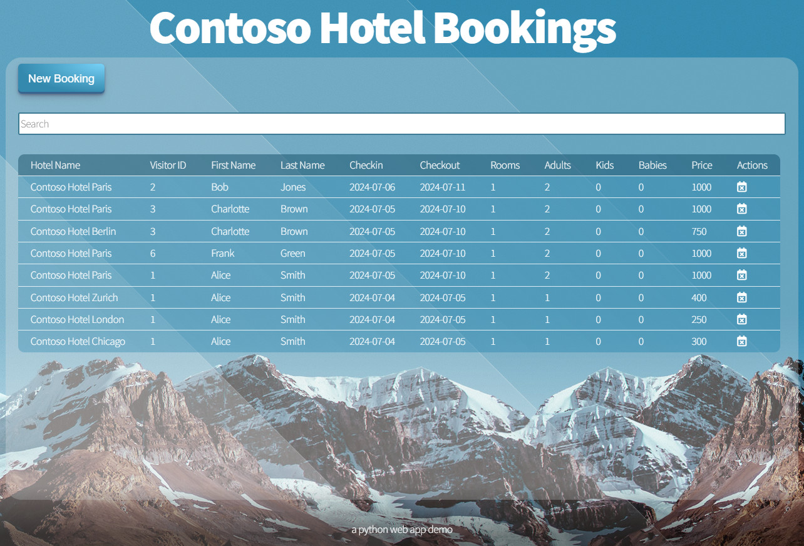

#  Contoso Hotel Demo in Python




## General setup guidance

 1. Configure Environment Variable ``MSSQL_CONNECTION_STRING`` or supply a file named ``./secrets-store/MSSQL_CONNECTION_STRING``
 1. Run the app: ``gunicorn --bind=0.0.0.0 --workers=4 startup:app``
 1. Populate Data:
    1.  **Either** go to: http://localhost:8000/setup
    1.  **Or** invoke the Rest API: ``Invoke-RestMethod -Uri 'http://localhost:8000/api/setup' -Method Post -Body '{ "drop_schema" : true, "create_schema": true, "populate_data" : true }' -ContentType 'application/json'``


## Docker based setup

 1. Build the Docker Image: ``docker build -t pycontosohotel:latest .``
 1. Run the Docker Container:
    1. Using environment variable  ``docker run -p 8000:8000 -e MSSQL_CONNECTION_STRING='DRIVER={ODBC Driver 18 for SQL Server};SERVER=MSSQLINSTANCENAME.database.windows.net;DATABASE=MSSQLDBNAME;UID=MSSQLUSERNAME;PWD=*******' pycontosohotel:latest``
    1. Using volume mount
       1. Create a file ``MSSQL_CONNECTION_STRING`` with the connection string in the ``/path/to/secrets-store`` directory
       1. ``docker run -p 8000:8000 -v '/path/to/secrets-store:/app/secrets-store' pycontosohotel:latest``
 1. Populate Data:
    1.  **Either** go to: http://localhost:8000/setup
    1.  **Or** invoke the Rest API: ``Invoke-RestMethod -Uri 'http://localhost:8000/api/setup' -Method Post -Body '{ "drop_schema" : true, "create_schema": true, "populate_data" : true }' -ContentType 'application/json'``


# API documentation

## Get Hotels

**Endpoint:** ``GET /api/hotels``

| Get Parameter | Type | Default Value | Description |
| --- | --- | --- | --- |
| ``hotelname``  | string | *empty* | Optional Hotel Name to filter |
| ``exactMatch`` | bool | false | Optional exactMatch (``false`` uses ``like '%search%'`` ) |

**Response Codes:**
| Code | Description |
| --- | --- |
| 200 | Success |
| 400 | Bad Request (Invalid input data) |
| 500 | Internal Server Error (Server side processing error) |

**Example Response Body (Success - 200):**
```json
[
  {
    "hotelId": 6,
    "hotelname": "Contoso Hotel Los Angeles",
    "pricePerNight": 350.0
  }
]
```

**Example Response Body (Failure - 400 or 500):**
```json
{ 
   "success" : false,
   "error" : "Some error message here"
}
```

### Example Code
<details>
<summary>Click to expand</summary>

#### PowerShell

```powershell
Invoke-RestMethod -Uri 'http://localhost:8000/api/hotels'
```

#### Bash Curl
```bash
curl -X GET 'http://localhost:8000/api/hotels'
```
</details>


## Get Visitors

**Endpoint:** ``GET /api/visitors``

| Get Parameter | Type | Default Value | Description |
| --- | --- | --- | --- |
| ``name``  | string | *empty* | Optional Name to filter (first or last name) |
| ``exactMatch`` | bool | false | Optional exactMatch (``false`` uses ``like '%search%'`` ) |

**Response Codes:**
| Code | Description |
| --- | --- |
| 200 | Success |
| 400 | Bad Request (Invalid input data) |
| 500 | Internal Server Error (Server side processing error) |

**Example Response Body (Success - 200):**
```json
[
  {
    "firstname": "Frank",
    "lastname": "Green",
    "visitorId": 6
  }
]
```

**Example Response Body (Failure - 400 or 500):**
```json
{ 
   "success" : false,
   "error" : "Some error message here"
}
```

### Example Code
<details>
<summary>Click to expand</summary>

#### PowerShell

```powershell
Invoke-RestMethod -Uri 'http://localhost:8000/api/visitors'
```

#### Bash Curl
```bash
curl -X GET 'http://localhost:8000/api/visitors'
```
</details>


## Get Bookings

**Endpoint:** ``GET /api/bookings``

| Get Parameter | Type | Default Value | Description |
| --- | --- | --- | --- |
| ``visitorId``  | int | *empty* | Optional visitorId to filter |
| ``hotelId``    | int | *empty* | Optional hotelId to filter   |
| ``fromdate``   | datetime (YYYY-MM-DD) | *empty* | Optionally filter for bookings that are after this date   |
| ``untildate``  | datetime (YYYY-MM-DD) | *empty* | Optionally filter for bookings that are before this date  |

**Response Codes:**
| Code | Description |
| --- | --- |
| 200 | Success |
| 400 | Bad Request (Invalid input data) |
| 500 | Internal Server Error (Server side processing error) |

**Example Response Body (Success - 200):**
```json
[
  {
    "bookingId": 2,
    "checkin": "2024-07-05",
    "checkout": "2024-07-10",
    "hotelId": 2,
    "hotelname": "Contoso Hotel Paris",
    "visitorId": 2,
    "firstname": "Bob",
    "lastname": "Jones",
    "adults": 2,
    "kids": 0,
    "babies": 0,
    "rooms": 1,
    "price": 1000.0
  }
]
```

**Example Response Body (Failure - 400 or 500):**
```json
{ 
   "success" : false,
   "error" : "Some error message here"
}
```

### Example Code
<details>
<summary>Click to expand</summary>

#### PowerShell

```powershell
Invoke-RestMethod -Uri 'http://localhost:8000/api/bookings'
```

#### Bash Curl
```bash
curl -X GET 'http://localhost:8000/api/bookings'
```
</details>


## Get a single Hotel

**Endpoint:** ``GET /api/hotel?hotelId=<int>``

**Response Codes:**
| Code | Description |
| --- | --- |
| 200 | Success |
| 400 | Bad Request (Invalid input data) |
| 500 | Internal Server Error (Server side processing error) |

**Example Response Body (Success - 200):**
```json
{
   "hotelId": 6,
   "hotelname": "Contoso Hotel Los Angeles",
   "pricePerNight": 350.0
}
```

**Example Response Body (Failure - 400 or 500):**
```json
{ 
   "success" : false,
   "error" : "Some error message here"
}
```

### Example Code
<details>
<summary>Click to expand</summary>

#### PowerShell

```powershell
Invoke-RestMethod -Uri 'http://localhost:8000/api/hotel?hotelId=2'
```

#### Bash Curl
```bash
curl -X GET 'http://localhost:8000/api/hotel?hotelId=2'
```
</details>


## Get a single Visitor

**Endpoint:** ``GET /api/visitor?visitorId=<int>``

**Response Codes:**
| Code | Description |
| --- | --- |
| 200 | Success |
| 400 | Bad Request (Invalid input data) |
| 500 | Internal Server Error (Server side processing error) |

**Example Response Body (Success - 200):**
```json
{
   "firstname": "Frank",
   "lastname": "Green",
   "visitorId": 6
}
```

**Example Response Body (Failure - 400 or 500):**
```json
{ 
   "success" : false,
   "error" : "Some error message here"
}
```

### Example Code
<details>
<summary>Click to expand</summary>

#### PowerShell

```powershell
Invoke-RestMethod -Uri 'http://localhost:8000/api/visitor?visitorId=2'
```

#### Bash Curl
```bash
curl -X GET 'http://localhost:8000/api/visitor?visitorId=2'
```
</details>


## Get a single Booking

**Endpoint:** ``GET /api/booking?bookingId=<int>``

**Response Codes:**
| Code | Description |
| --- | --- |
| 200 | Success |
| 400 | Bad Request (Invalid input data) |
| 500 | Internal Server Error (Server side processing error) |

**Example Response Body (Success - 200):**
```json
{
   "bookingId": 2,
   "visitorId": 6,
   "hotelId": 2,
   "checkin": "2024-07-05",
   "checkout": "2024-07-10",
   "rooms": 1,
   "adults": 2,
   "kids": 0,
   "babies": 0,
   "price": 1000.0
}
```

**Example Response Body (Failure - 400 or 500):**
```json
{ 
   "success" : false,
   "error" : "Some error message here"
}
```

### Example Code
<details>
<summary>Click to expand</summary>

#### PowerShell

```powershell
Invoke-RestMethod -Uri 'http://localhost:8000/api/booking?bookingId=2'
```

#### Bash Curl
```bash
curl -X GET 'http://localhost:8000/api/booking?bookingId=2'
```
</details>


## Create Hotel

**Endpoint:** ``PUT /api/hotel``

**Request Body:**
```json
{
   "hotelname": "Contoso Hotel Los Angeles",
   "pricePerNight": 350.0
}
```

**Response Codes:**
| Code | Description |
| --- | --- |
| 200 | Success |
| 400 | Bad Request (Invalid input data) |
| 500 | Internal Server Error (Server side processing error) |

**Example Response Body (Success - 200):**
```json
{
   "hotelId": 6,
   "hotelname": "Contoso Hotel Los Angeles",
   "pricePerNight": 350.0
}
```

**Example Response Body (Failure - 400 or 500):**
```json
{ 
   "success" : false,
   "error" : "Some error message here"
}
```


### Example Code
<details>
<summary>Click to expand</summary>

#### PowerShell

```powershell
Invoke-RestMethod -Uri 'http://localhost:8000/api/hotel' -Method Put -ContentType 'application/json' -Body (@{
    hotelname = 'Contoso Hotel Los Angeles II'
    pricePerNight = 350.0
} | ConvertTo-Json)
```

#### Bash Curl
```bash
curl -X PUT 'http://localhost:8000/api/hotel' -H 'Content-Type: application/json' -d '{
    "hotelname": "Contoso Hotel Los Angeles II",
    "pricePerNight": 350.0
}'
```
</details>

## Create Visitor

**Endpoint:** ``PUT /api/visitor``

**Request Body:**
```json
{
   "firstname": "Frank",
   "lastname": "Green"
}
```

**Response Codes:**
| Code | Description |
| --- | --- |
| 200 | Success |
| 400 | Bad Request (Invalid input data) |
| 500 | Internal Server Error (Server side processing error) |

**Example Response Body (Success - 200):**
```json
{
   "visitorId": 6,
   "firstname": "Frank",
   "lastname": "Green"
}
```

**Example Response Body (Failure - 400 or 500):**
```json
{ 
   "success" : false,
   "error" : "Some error message here"
}
```

### Example Code
<details>
<summary>Click to expand</summary>

#### PowerShell

```powershell
Invoke-RestMethod -Uri 'http://localhost:8000/api/visitor' -Method Put -ContentType 'application/json' -Body (@{
    firstname = 'Frank'
    lastname = 'Blue'
} | ConvertTo-Json)
```

#### Bash Curl
```bash
curl -X PUT 'http://localhost:8000/api/visitor' -H 'Content-Type: application/json' -d '{
    "firstname": "Frank",
    "lastname": "Blue"
}'
```
</details>

## Create Booking

**Endpoint:** ``PUT /api/booking``

**Request Body:**
```json
{
   "visitorId": 6,
   "hotelId": 2,
   "checkin": "2024-07-05",
   "checkout": "2024-07-10",
   "adults": 2,
   "kids": 0,       // optional
   "babies": 0,     // optional
   "rooms": 1,      // optional
   "price": 1000.0  // optional
}
```

**Response Codes:**
| Code | Description |
| --- | --- |
| 200 | Success |
| 400 | Bad Request (Invalid input data) |
| 500 | Internal Server Error (Server side processing error) |

**Example Response Body (Success - 200):**
```json
{
   "bookingId": 2,
   "visitorId": 6,
   "hotelId": 2,
   "checkin": "2024-07-05",
   "checkout": "2024-07-10",
   "rooms": 1,
   "adults": 2,
   "kids": 0,
   "babies": 0,
   "price": 1000.0
}
```

**Example Response Body (Failure - 400 or 500):**
```json
{ 
   "success" : false,
   "error" : "Some error message here"
}
```

### Example Code
<details>
<summary>Click to expand</summary>

#### PowerShell

```powershell
Invoke-RestMethod -Uri 'http://localhost:8000/api/booking' -Method Put -ContentType 'application/json' -Body (@{
    visitorId = 6
    hotelId = 2
    checkin = '2025-07-05'
    checkout = '2025-07-10'
    adults = 2
    kids = 0
    babies = 0
    rooms = 1
    price = 1000.0
} | ConvertTo-Json)
```

#### Bash Curl
```bash
curl -X PUT 'http://localhost:8000/api/booking' -H 'Content-Type: application/json' -d '{
    "visitorId": 6,
    "hotelId": 2,
    "checkin": "2025-07-05",
    "checkout": "2025-07-10",
    "adults": 2,
    "kids": 0,
    "babies": 0,
    "rooms": 1,
    "price": 1000.0
}'
```
</details>

## Update Hotel

**Endpoint:** ``POST /api/hotel``

**Request Body:**
```json
{
   "hotelId": 6,
   "hotelname": "Contoso Hotel Los Angeles",
   "pricePerNight": 350.0
}
```

**Response Codes:**
| Code | Description |
| --- | --- |
| 200 | Success |
| 400 | Bad Request (Invalid input data) |
| 500 | Internal Server Error (Server side processing error) |

**Example Response Body (Success - 200):**
```json
{
   "hotelId": 6,
   "hotelname": "Contoso Hotel Los Angeles",
   "pricePerNight": 350.0
}
```

**Example Response Body (Failure - 400 or 500):**
```json
{ 
   "success" : false,
   "error" : "Some error message here"
}
```

### Example Code
<details>
<summary>Click to expand</summary>

#### PowerShell

```powershell
Invoke-RestMethod -Uri 'http://localhost:8000/api/hotel' -Method Post -ContentType 'application/json' -Body (@{
    hotelId = 6
    hotelname = 'Contoso Hotel Los Angeles'
    pricePerNight = 350.0
} | ConvertTo-Json)
```

#### Bash Curl
```bash
curl -X POST 'http://localhost:8000/api/hotel' -H 'Content-Type: application/json' -d '{
    "hotelId": 6,
    "hotelname": "Contoso Hotel Los Angeles",
    "pricePerNight": 350.0
}'
```
</details>


## Update Visitor

**Endpoint:** ``POST /api/visitor``

**Request Body:**
```json
{
   "visitorId": 6,
   "firstname": "Frank",
   "lastname": "Green"
}
```

**Response Codes:**
| Code | Description |
| --- | --- |
| 200 | Success |
| 400 | Bad Request (Invalid input data) |
| 500 | Internal Server Error (Server side processing error) |

**Example Response Body (Success - 200):**
```json
{
   "visitorId": 6,
   "firstname": "Frank",
   "lastname": "Green"
}
```

**Example Response Body (Failure - 400 or 500):**
```json
{ 
   "success" : false,
   "error" : "Some error message here"
}
```

### Example Code
<details>
<summary>Click to expand</summary>

#### PowerShell

```powershell
Invoke-RestMethod -Uri 'http://localhost:8000/api/visitor' -Method Post -ContentType 'application/json' -Body (@{
    visitorId = 6
    firstname = 'Frank'
    lastname = 'Green'
} | ConvertTo-Json)
```

#### Bash Curl
```bash
curl -X POST 'http://localhost:8000/api/visitor' -H 'Content-Type: application/json' -d '{
    "visitorId": 6,
    "firstname": "Frank",
    "lastname": "Green"
}'
```
</details>


## Delete Hotel

**Endpoint:** ``DELETE /api/hotel?hotelId=<int>``

| Url Parameter | Type | Default Value | Description |
| --- | --- | --- | --- |
| ``hotelId``  | int | *empty* | Required id of the hotel |

**Response Codes:**
| Code | Description |
| --- | --- |
| 200 | Success |
| 400 | Bad Request (Invalid input data) |
| 500 | Internal Server Error (Server side processing error) |

**Example Response Body (Success - 200):**
```json
{
   "success": true,
   "deleted": true,  // indicates if deletion was necessary
   "hotelId": 6
}
```

**Example Response Body (Failure - 400 or 500):**
```json
{ 
   "success" : false,
   "error" : "Some error message here"
}
```

### Example Code
<details>
<summary>Click to expand</summary>

#### PowerShell

```powershell
Invoke-RestMethod -Uri 'http://localhost:8000/api/hotel?hotelId=2' -Method Delete
```

#### Bash Curl
```bash
curl -X DELETE 'http://localhost:8000/api/hotel?hotelId=2'
```
</details>

## Delete Visitor

**Endpoint:** ``DELETE /api/visitor?visitorId=<int>``

| Url Parameter | Type | Default Value | Description |
| --- | --- | --- | --- |
| ``visitorId``  | int | *empty* | Required id of the visitor |


**Response Codes:**
| Code | Description |
| --- | --- |
| 200 | Success |
| 400 | Bad Request (Invalid input data) |
| 500 | Internal Server Error (Server side processing error) |

**Example Response Body (Success - 200):**
```json
{
   "success": true,
   "deleted": true,  // indicates if deletion was necessary
   "visitorId": 6
}
```

**Example Response Body (Failure - 400 or 500):**
```json
{ 
   "success" : false,
   "error" : "Some error message here"
}
```

### Example Code
<details>
<summary>Click to expand</summary>

#### PowerShell

```powershell
Invoke-RestMethod -Uri 'http://localhost:8000/api/visitor?visitorId=2' -Method Delete
```

#### Bash Curl
```bash
curl -X DELETE 'http://localhost:8000/api/visitor?visitorId=2'
```
</details>

## Delete Booking

**Endpoint:** ``DELETE /api/booking?bookingId=<int>``

| Url Parameter | Type | Default Value | Description |
| --- | --- | --- | --- |
| ``bookingId``  | int | *empty* | Required id of the booking |


**Response Codes:**
| Code | Description |
| --- | --- |
| 200 | Success |
| 400 | Bad Request (Invalid input data) |
| 500 | Internal Server Error (Server side processing error) |

**Example Response Body (Success - 200):**
```json
{
   "success": true,
   "deleted": true,  // indicates if deletion was necessary
   "bookingId": 2
}
```

**Example Response Body (Failure - 400 or 500):**
```json
{ 
   "success" : false,
   "error" : "Some error message here"
}
```

### Example Code
<details>
<summary>Click to expand</summary>

#### PowerShell

```powershell
Invoke-RestMethod -Uri 'http://localhost:8000/api/booking?bookingId=2' -Method Delete
```

#### Bash Curl
```bash
curl -X DELETE 'http://localhost:8000/api/booking?bookingId=2'
```
</details>


## Setup the Database

**Endpoint:** ``POST /api/setup``

**Request Body:**
```json
{
   "drop_schema"  : false,
   "create_schema": true,
   "populate_data": true
}
```

**Response Codes:**
| Code | Description |
| --- | --- |
| 200 | Success |
| 400 | Bad Request (Invalid input data) |
| 500 | Internal Server Error (Server side processing error) |

**Example Response Body (Success - 200):**
```json
{
   "success": true,
   "drop_schema": false,
   "create_schema": { 
      "hotels": false,
      "visitors": false,
      "bookings": true 
   },
   "populate_data": { 
      "hotels": false,
      "visitors": true,
      "bookings": true
   }
}
```

**Example Response Body (Failure - 400 or 500):**
```json
{ 
   "success" : false,
   "error" : "Some error message here"
}
```

### Example Code
<details>
<summary>Click to expand</summary>

#### PowerShell

```powershell
Invoke-RestMethod -Uri 'http://localhost:8000/api/setup' -Method Post -ContentType 'application/json' -Body (@{
    drop_schema = $true
    create_schema = $true
    populate_data = $true
} | ConvertTo-Json)
```

#### Bash Curl
```bash
curl -X POST 'http://localhost:8000/api/setup' -H 'Content-Type: application/json' -d '{
    "drop_schema": true,
    "create_schema": true,
    "populate_data": true
}'
```
</details>